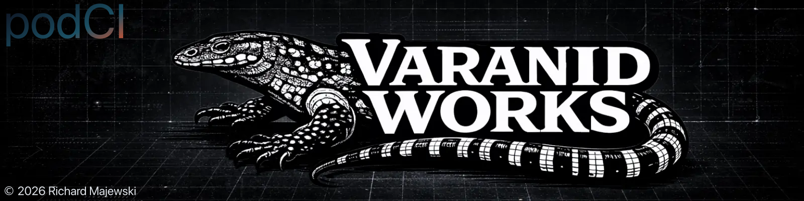

<!-- SPDX-License-Identifier: MIT OR Apache-2.0 -->
<!-- Copyright (c) 2026 Richard Majewski - Varanid Works -->

<p align="center">
  
</p>

[](https://github.com/UglyEgg/podCI/actions/workflows/ci.yml)
[](https://github.com/UglyEgg/podCI/actions/workflows/pages.yml)

# podCI

`podCI` ("Podman Continuous Integration") is a **local-first, Podman-backed CI runner** meant to be embedded into repository templates so teams can compile and test quickly with consistent behavior across machines.

It is designed for **multi-language repos** and mixed stacks (common in KDE/Qt and platform tooling): Rust, C++, and (soon) Python via `uv`.

## Features

- Containerized step execution via Podman
- Profile-driven workflows (`dev`, `ci`, `release`, etc.)
- Namespaced caches (fast reruns, no cross-project contamination)
- Machine-readable run manifests
- JSONL logging mode
- Safe pruning of podCI-owned caches
- Arch/.deb/.rpm packaging scaffolding + GitHub release automation

## Quick start

```bash
podci init --template rust-musl --dir /tmp/podci-smoke
cd /tmp/podci-smoke
podci run
podci manifest show --latest
```

Dry-run:

```bash
podci run --dry-run
```

Structured logs:

```bash
PODCI_LOG_FORMAT=jsonl podci run
```

## Templates

Templates are shipped as on-disk data (so distros and users can customize them).

- List: `podci templates list`
- Show origin: `podci templates where <name>`
- Export bundle: `podci templates export <name> <output>.tar.gz`

An embedded `generic` template is always available as a fallback.

Shipped templates include:

- `rust-musl` (Alpine/musl; recommended default)
- `rust-glibc` (Debian/glibc)
- `cpp` (CMake/Ninja skeleton)
- `kde-mixed` (mixed repo skeleton)

Planned:

- `python-uv`

## Documentation

User documentation is published via **Zensical** (MkDocs/Material-compatible) under `docs/`.

Local build:

```bash
python -m venv .venv
. .venv/bin/activate
pip install -r docs/requirements.txt
./scripts/gen_rustdoc_into_docs.sh
zensical serve
```

Rust API docs are generated into `docs/rustdoc/api/` via `./scripts/gen_rustdoc_into_docs.sh` and are published alongside the docs site.

## Licensing

Dual-licensed under either:

- Apache License, Version 2.0 (`LICENSE-APACHE-2.0`)
- MIT License (`LICENSE-MIT`)

Unless you explicitly state otherwise, any contribution intentionally submitted for inclusion is licensed under the same terms.
