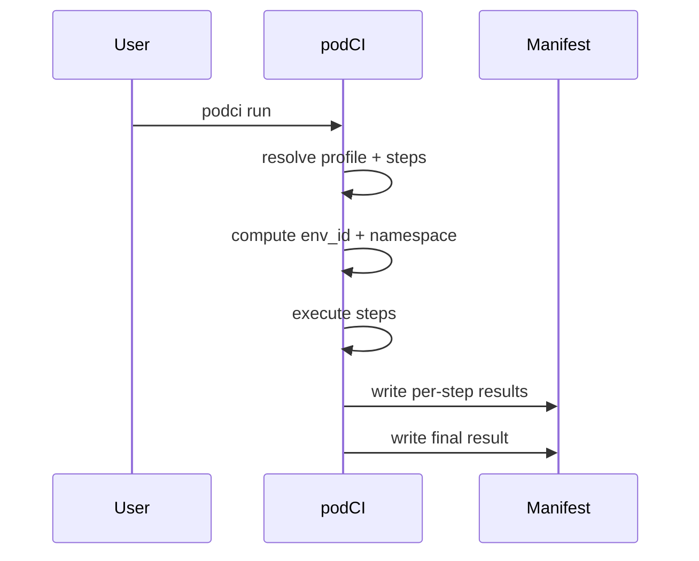

<!-- SPDX-License-Identifier: MIT OR Apache-2.0 -->
<!-- Copyright (c) 2026 Richard Majewski - Varanid Works -->

# Manifests

Every `podci run` produces a manifest describing what executed and what happened. The manifest is designed for both humans (quick debugging) and automation (stable schema).

## Storage location

Manifests are written under XDG state:

- Typical path: `~/.local/state/podci/`
- Latest: `manifest.json`
- Per-run: `runs/<run_id>/manifest.json`


### Per-step logs

For non-dry runs, podCI captures each step’s stdout/stderr and stores them alongside the manifest:

- `runs/<run_id>/logs/<step>.stdout`
- `runs/<run_id>/logs/<step>.stderr`

The manifest step entries may include `stdout_path` and `stderr_path` as relative paths from `runs/<run_id>/`.


## Contents

A manifest includes:

- podCI version
- project/job/profile identifiers
- namespace + env_id
- base image digest (when known)
- per-step argv, duration, exit code
- overall result status and error message



## Viewing

```bash
podci manifest show --latest
podci manifest show --run <id>
```

If no manifest exists yet, run `podci run` once.

