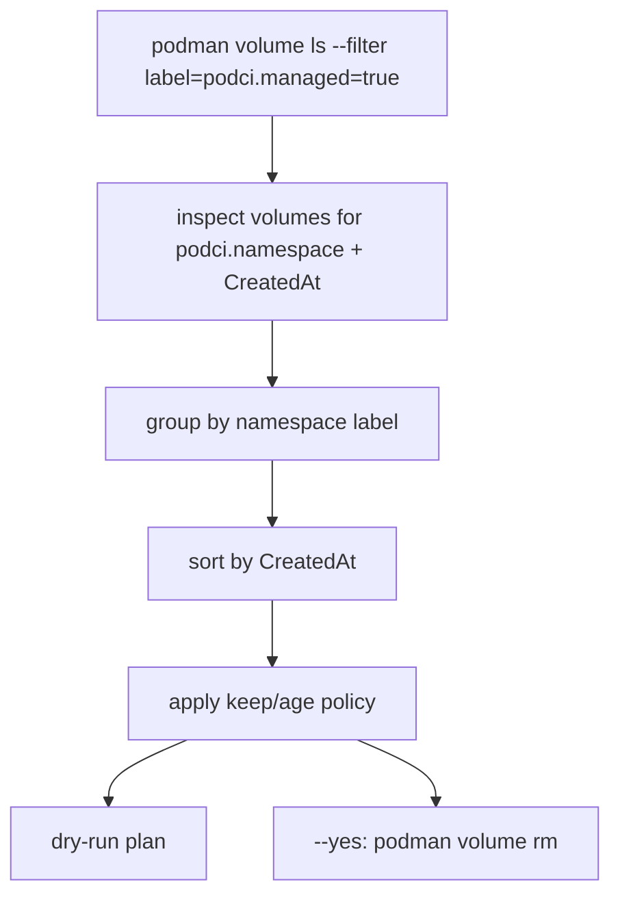

<!-- SPDX-License-Identifier: MIT OR Apache-2.0 -->
<!-- Copyright (c) 2026 Richard Majewski - Varanid Works -->

# Prune

podCI creates Podman volumes for caches. Over time you may want to remove old namespaces to reclaim disk.

`podci prune` is conservative by design: it only targets volumes that podCI explicitly labels as managed.

## Ownership model

podCI labels cache volumes at creation time:

- `podci.managed=true`
- `podci.namespace=<namespace>`
- `podci.env_id=<env_id>`
- `podci.volume_kind=cargo_registry|cargo_git|target`

Prune only considers volumes with `podci.managed=true`. Volumes that predate labeling are not pruned automatically.

## Dry-run plan (default)

```bash
podci prune --keep 3
```

This prints a deletion plan but does not remove anything.

## Apply

```bash
podci prune --keep 3 --yes
```

## Policy

- `--keep N` keeps the newest N namespaces and prunes older ones.
- `--older-than-days D` prunes only namespaces older than D days.


